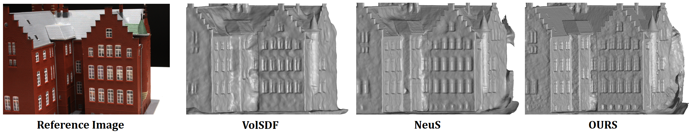

# HF-NeuS: Improved Surface Reconstruction Using High-Frequency Details

  

  

**HF-NeuS: Improved Surface Reconstruction Using High-Frequency Details** 

*Yiqun Wang, Ivan Skorokhodov, Peter Wonka*

**[Paper (arXiv)](https://arxiv.org/abs/2206.07850)**

*Coming Soon*

## Abstract
Neural rendering can be used to reconstruct implicit representations of shapes without 3D supervision. However, current neural surface reconstruction methods have difficulty learning high-frequency geometry details, so the reconstructed shapes are often over-smoothed. We develop HF-NeuS, a novel method to improve the quality of surface reconstruction in neural rendering. We follow recent work to model surfaces as signed distance functions (SDFs). First, we offer a derivation to analyze the relationship between the SDF, the volume density, the transparency function, and the weighting function used in the volume rendering equation and propose to model transparency as transformed SDF. Second, we observe that attempting to jointly encode high-frequency and low-frequency components in a single SDF leads to unstable optimization. We propose to decompose the SDF into a base function and a displacement function with a coarse-to-fine strategy to gradually increase the high-frequency details. Finally, we design an adaptive optimization strategy that makes the training process focus on improving those regions near the surface where the SDFs have artifacts. Our qualitative and quantitative results show that our method can reconstruct fine-grained surface details and obtain better surface reconstruction quality than the current state of the art.
